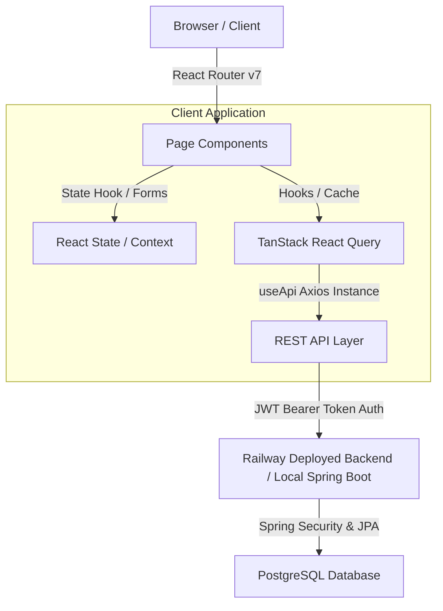

# 🚀 Stride Job Portal - Production-Ready Frontend

Stride is an enterprise-grade, high-performance **Job Portal Web Application** built with **React 19 (Fiber)**, **Vite 8**, and **Tailwind CSS v4**. It features role-based access control, real-time job listings, interactive candidate pipelines, and persistent JWT-based session management, communicating with a deployed Spring Boot REST API.

---

## 🧭 Table of Contents
- [📸 Overview & Application Screenshots](#-overview--application-screenshots)
- [✨ Core Features & Role Capabilities](#-core-features--role-capabilities)
- [🛠️ Tech Stack & Dependencies](#-tech-stack--dependencies)
- [📐 System Architecture & Data Flow](#-system-architecture--data-flow)
- [📁 Directory Structure](#-directory-structure)
- [🗺️ Routing & Access Control Matrix](#-routing--access-control-matrix)
- [🔌 REST API Integration & useApi Custom Hook](#-rest-api-integration--useapi-custom-hook)
- [⚙️ Environment Variables & Deployment Config](#-environment-variables--deployment-config)
- [🚀 Local Setup & Installation Guide](#-local-setup--installation-guide)
- [🎨 Design System, Styling, & Theme Engine](#-design-system-styling--theme-engine)
- [🤝 Contribution Guidelines](#-contribution-guidelines)
- [📄 License](#-license)
- [👨‍💻 Author](#-author)

---

## 📸 Overview & Application Screenshots

Stride is designed to simplify the recruitment process for both job seekers and hiring teams. It uses a modern dashboard UI to showcase stats, track progress, and manage candidate workflows.

- **Dual-Dashboard Ecosystem**: Dynamic portals for both Job Seekers and Employers.
- **Real-Time Job Feeds**: Live listing fetches with skeletal loading placeholders to minimize Cumulative Layout Shift (CLS).
- **Interactive Hiring Pipeline**: Drag-and-drop-style status transitions (Shortlist, Schedule, Reject, Hire) for recruiters.
- **Comprehensive Theme Support**: Fluid light-to-dark transition using modern CSS custom properties and tailwind selectors.

---

## ✨ Core Features & Role Capabilities

### 👤 Authentication & Security
- **Unified Auth Gateway**: A clean, single-page portal with tabs for switching between Login and Registration.
- **JWT Persistence & Auto-Injection**: JWTs are automatically saved to `localStorage` and injected as a `Bearer` token in subsequent API headers.
- **Protected Routing & Verification**: Custom wrapper components (`ProtectedRoute` & `RoleRoute`) prevent unauthorized views.
- **Auto-Logout Session Lifespan**: Detects `401 Unauthorized` responses from the backend API, automatically clearing credentials and redirecting users to `/auth`.

### 🧑‍💻 Job Seeker Flow
- **Analytics Dashboard**: Tracks applications sent, profile views, scheduled interviews, and saved jobs.
- **Job Finder & Details Grid**: Paginated grid of jobs with options to filter, search, and view detailed job profiles in an overlay modal.
- **One-Click Apply**: Immediate application request dispatch with visual state updates.
- **Interactive Profile Builder**: Showcases contact details, bio, and a skill matrix categorized by proficiency level.
- **Application History**: Lists previous job applications with chronological statuses (Pending, Shortlisted, Interviewing, Hired, Rejected).

### 🏢 Recruiter & Employer Flow
- **Recruiter Analytics Dashboard**: Visual summary of active job posts, candidate pools, interview counts, and pending offers.
- **Applicant Pipeline Manager**: Grid of applicant profiles, resumes, and dynamic buttons to move candidates through stages (e.g., Shortlisted, Scheduled Interview, Rejected, Hired).
- **Job Postings Wizard**: Multi-field form validated with `react-hook-form` to publish jobs immediately.
- **Company Profile Hub**: Custom workspace to update logos, descriptions, location, scale, and web links.
- **Employer Profile Edit**: Update personal recruiter details and account preferences.

---

## 🛠️ Tech Stack & Dependencies

| Tool | Version | Ecosystem Purpose |
|---|---|---|
| **React** | `19.2.4` | Component framework |
| **Vite** | `8.0.4` | Lightning-fast build tool and development server |
| **Tailwind CSS** | `4.2.2` | Modern CSS utility framework |
| **React Router DOM** | `7.14.1` | Declarative routing with path parameters |
| **TanStack React Query** | `5.100.9` | Client-side cache management, queries, and mutation states |
| **Axios** | `1.15.0` | Promise-based HTTP client for browser requests |
| **React Hook Form** | `7.75.0` | High-performance, low-re-render form controller |
| **React Helmet Async** | `3.0.0` | Declarative SEO header manipulation |
| **Font Awesome** | `7.2.0` | Solid, Regular, and Brand icon components |

---

## 📐 System Architecture & Data Flow



### Key Architectural Patterns
1. **Code Splitting (Lazy Loading)**: Routes are dynamically imported via `lazy()` and wrapped in `<Suspense>` with a centralized spinner, reducing initial bundle size and improving load times.
2. **Context-Driven Global State**: `AuthContext` controls authentication token lifetimes and role mappings, while `ThemeContext` governs dark-theme toggles.
3. **Query Caching Layer**: React Query automatically cache lists of jobs and applicants with a configured default `staleTime` of 2 minutes to reduce server load.

---

## 📁 Directory Structure

```
stride-frontend/
├── public/                     # Static assets (images, favicon, manifest)
├── src/
│   ├── components/
│   │   ├── Companies.jsx       # Grid list showing all registered companies
│   │   ├── CompanyCard.jsx     # Card component for company preview
│   │   ├── Employerdashboard.jsx # Recruitment statistics and panels
│   │   ├── ErrorBoundary.jsx   # Error boundary fallbacks for uncaught exceptions
│   │   ├── JobCard.jsx         # Modular job preview card (Salary, Location, Action)
│   │   ├── JobDetailModal.jsx  # Interactive overlay displaying job details
│   │   ├── Jobseekerdashboard.jsx # Job seeker metrics, analytics, and applications
│   │   ├── Navbar.jsx          # Sticky header with responsive collapse and theme toggle
│   │   ├── PageNotFound.jsx    # Custom 404 handler
│   │   ├── ProfileCard.jsx     # Reusable form field layout
│   │   ├── Search.jsx          # Advanced search component (Title, Location)
│   │   └── SidebarLayout.jsx   # Standardized dashboard sidebar layout
│   │
│   ├── pages/
│   │   ├── AllApplicants.jsx   # Recruiter view: applicant details and status change actions
│   │   ├── AuthPage.jsx        # Login/Registration tabbed switcher
│   │   ├── CompanyProfile.jsx  # Company details editor
│   │   ├── EditProfile.jsx     # Core profile info form (Seeker/Employer)
│   │   ├── EmployerProfile.jsx # Recruiter personal profile details
│   │   ├── HomePage.jsx        # Landing page with hero, stats, and call-to-actions
│   │   ├── Interviews.jsx      # Interview scheduler and logs panel
│   │   ├── JobList.jsx         # Main job listing search engine
│   │   ├── MyApplications.jsx  # Seeker view: applications status timeline
│   │   ├── MyJobs.jsx          # Recruiter view: jobs posted by logged-in user
│   │   ├── PostJob.jsx         # Employer new job creator form
│   │   └── UserProfile.jsx     # Job seeker resume view
│   │
│   ├── Hooks/
│   │   └── useApi.jsx          # Core HTTP API client wrapper hook
│   │
│   ├── queries/
│   │   ├── employerQueries.jsx # React Query integrations for employer requests
│   │   └── jobQueries.jsx      # React Query integrations for job-related actions
│   │
│   ├── context/
│   │   ├── AuthContext.jsx     # Authentication wrapper state
│   │   └── ThemeContext.jsx    # Light / Dark mode layout toggler
│   │
│   ├── App.css                 # Route layouts and custom classes
│   ├── App.jsx                 # Route configurations and protected guards
│   ├── index.css               # Tailwind CSS imports and custom styling rules
│   └── main.jsx                # Application root mounting with global providers
│
├── .env                        # Local developer environment setup
├── .env.production             # Production environment setup
├── eslint.config.js            # Linter rules configuration
├── index.html                  # HTML entry template
├── package.json                # Project configurations & dependency index
├── vite.config.js              # Vite compiler optimizations and plugins
└── README.md                   # Detailed documentation
```

---

## 🗺️ Routing & Access Control Matrix

The routing table below shows the URLs, components, role requirements, and description of all routes in Stride:

| URL Path | Mounted Page / Component | Access Level | Role Constraint | Details |
| :--- | :--- | :--- | :--- | :--- |
| `/` | `HomePage` | Public | None | Hero landing page, feature showcase, site statistics |
| `/auth` | `AuthPage` | Public | None | Dynamic Login and Register panel with JWT retrieval |
| `/jobs` | `JobList` | Public | None | Paginated search, filter, and detail modal preview |
| `/companies` | `Companies` | Public | None | Grid of registered organizations |
| `/me` | `UserProfile` | Authenticated | Seeker / Recruiter | Displays user details, resumes, and credentials |
| `/me/edit` | `EditProfile` | Authenticated | Seeker / Recruiter | Form to modify personal info, contact, and skills |
| `/dashboard/jobseeker` | `JobSeekerDashboard` | Protected | `JOBSEEKER` | Seeker metrics, saved jobs, application pipelines |
| `/dashboard/employer` | `EmployerDashboard` | Protected | `EMPLOYER` | Recruiter statistics, candidate status tracking, quick actions |
| `/post-job` | `PostJob` | Protected | `EMPLOYER` | Job listing publisher form (title, tags, salary, location) |
| `/company-profile` | `CompanyProfile` | Protected | `EMPLOYER` | Update company description, employees count, website URL |
| `/employer/profile` | `EmployerProfile` | Protected | `EMPLOYER` | Recruiter-specific personal details and account details |
| `/all-applicants` | `AllApplicants` | Protected | `EMPLOYER` | View all applicants, resumes, and change application status |
| `/interviews` | `Interviews` | Protected | `EMPLOYER` | Setup and track interviews schedule with candidates |
| `/my-jobs` | `MyJobs` | Protected | `EMPLOYER` | Detailed grid of active and draft jobs posted by the employer |

---

## 🔌 REST API Integration & useApi Custom Hook

Stride communicates with the REST backend using a custom Axios wrapper, `useApi.jsx`. This hook automatically injects the active JWT token, tracks loading states, and simplifies error management.

### Key Features of `useApi` Hook:
- **Authorization Injection**: Attaches `Authorization: Bearer <JWT>` header if token exists in `localStorage`.
- **Base URL Resolver**: Dynamically uses `VITE_API_BASE_URL` or defaults to `http://localhost:8080/api/v1`.
- **401 Unauthorized Interceptor**: Triggers automatic logout and redirects to `/auth` on session timeout.
- **Convenient Short-hand Methods**: Provides `get`, `post`, `put`, and `del` callbacks.

### 📝 Wrapper Usage Example:
```jsx
import useApi from "../Hooks/useApi";

function MyComponent() {
  const { get, post, loading, error } = useApi();

  const handleApply = async (jobId) => {
    try {
      const response = await post(`/applications/${jobId}/apply`, {});
      alert("Application sent successfully!");
    } catch (err) {
      console.error("Failed to apply:", error);
    }
  };
}
```

### 📡 Main REST API Endpoint Map:

| Category | Route | Method | Payload / Response |
| :--- | :--- | :--- | :--- |
| **Auth** | `/auth/register` | `POST` | User registration body -> `{ message, success }` |
| **Auth** | `/auth/login` | `POST` | `{ email, password }` -> `{ token, role, email }` |
| **Jobs** | `/jobs` | `GET` | Params: `page`, `size`, `search` -> Paginated Jobs list |
| **Jobs** | `/jobs` | `POST` | Job payload -> Created Job data (Employer only) |
| **Jobs** | `/jobs/{id}` | `DELETE`| Path variable `{id}` -> Status response |
| **Applications**| `/applications/{jobId}/apply` | `POST` | Job Seeker applying -> Saved application |
| **Applications**| `/applications/status/{appId}`| `PUT` | Recruiter changing status -> Updated application |
| **Profiles** | `/users/profile` | `GET`/`PUT` | Profile details payload -> Updated profiles |

---

## ⚙️ Environment Variables & Deployment Config

Stride reads configuration variables at build time using Vite's `import.meta.env` loader.

Create the following files in the project root:

### `.env` (Local Development Environment)
```env
VITE_API_BASE_URL=http://localhost:8080/api/v1
```

### `.env.production` (Production Environment)
```env
VITE_API_BASE_URL=https://job-portal-backend-production-c267.up.railway.app/api/v1
```

---

## 🚀 Local Setup & Installation Guide

Follow these steps to run the application locally on your computer:

### 1. Prerequisites
- **Node.js**: Version `20.x` or higher (LTS recommended).
- **npm**: Version `10.x` or higher.
- **Backend API**: The backend server should be running, either locally on port `8080` or deployed on Railway.

### 2. Installation
```bash
# Clone the repository
git clone https://github.com/Kawatra-29/job-portal-frontend.git

# Move into the project directory
cd job-portal-frontend

# Clean install packages
npm install
```

### 3. Running Development Server
To start the hot-reloading development server locally:
```bash
npm run dev
```
Open **[http://localhost:5173](http://localhost:5173)** in your browser to view the application.

### 4. Code Quality & Formatting
Run ESLint to check for code issues:
```bash
npm run lint
```

### 5. Compiling for Production
Build static files optimized for deployment:
```bash
npm run build
```
To run and test the compiled production version locally:
```bash
npm run preview
```

---

## 🎨 Design System, Styling, & Theme Engine

The user interface follows a modern design language based on Tailwind CSS v4 custom settings.

### Color & Styling Palettes:
- **Primary Color**: Blue Accent (`#2563eb`) - used for primary CTA buttons, badges, links, and seeker flows.
- **Accent Color**: Violet Accent (`#7c3aed`) - used for recruiter elements, admin panels, and special dashboard features.
- **Neutral Colors**: Slate hues (`#0f172a` for Dark background, `#f8fafc` for Light background).
- **Borders & Shapes**: Soft-pill layouts with border radii from `10px` to `24px` to create a modern feel.

### Theme Switcher Setup (Dark & Light Mode):
- The `ThemeProvider` injects or removes the `dark` class from the `document.documentElement` element.
- Tailwind v4 classes use modifiers like `dark:bg-slate-900` and `dark:text-white` to automatically adapt colors when the class is added.
- The chosen setting is saved in `localStorage` as `theme` (`light` or `dark`) to keep the user's preference across page reloads.

---

## 🤝 Contribution Guidelines

We welcome pull requests and contributions from the community. Please follow these guidelines:

1. **Fork** the repository and create your custom feature branch:
   ```bash
   git checkout -b feature/amazing-feature
   ```
2. Make sure your changes follow the style rules and pass lint checks:
   ```bash
   npm run lint
   ```
3. Commit your changes with descriptive commit messages:
   ```bash
   git commit -m "feat: add amazing recruiter dashboard panel"
   ```
4. Push your branch to GitHub:
   ```bash
   git push origin feature/amazing-feature
   ```
5. Open a **Pull Request** targeting the `main` branch.

---

## 📄 License

This software is licensed under the **MIT License**. For details, view the [LICENSE](LICENSE) file in the repository root.

---

## 👨‍💻 Author

**Saurabh Kawatra**  
*Java Backend Developer | React & Frontend Enthusiast*

- 📧 Email: [saurabhkawatra2001@gmail.com](mailto:saurabhkawatra2001@gmail.com)
- 🖥️ GitHub: [@Kawatra-29](https://github.com/Kawatra-29)

---

> Built with ❤️ using **React 19**, **Vite**, and **Tailwind CSS v4** connected to **Spring Boot**.